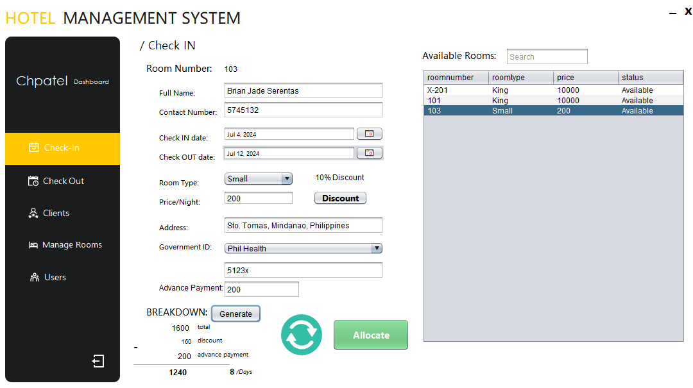
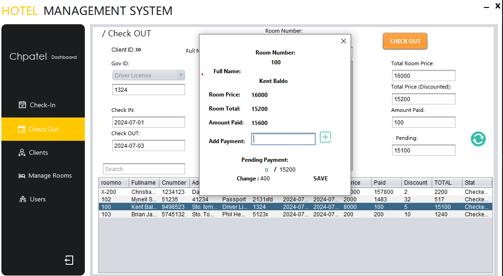
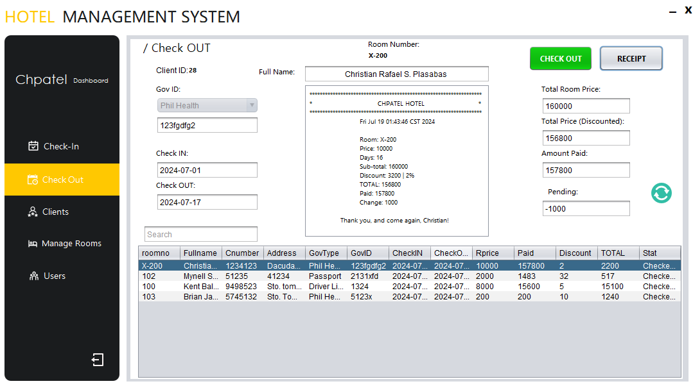
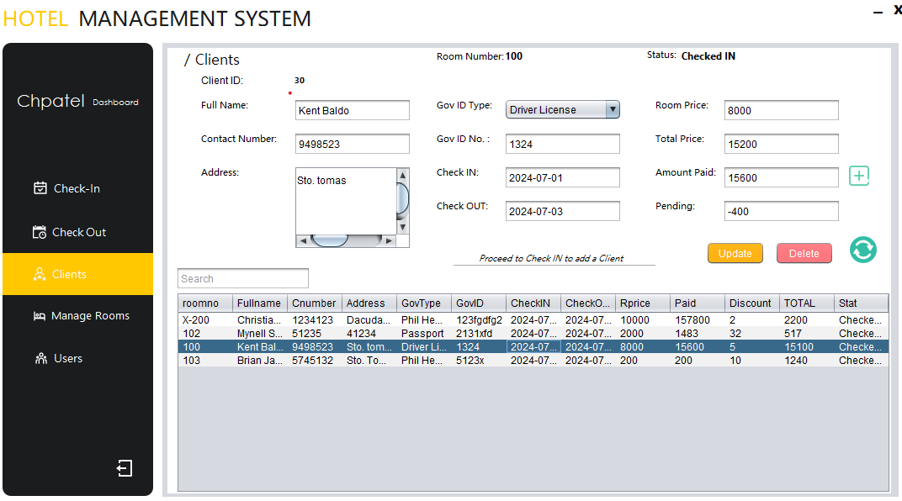
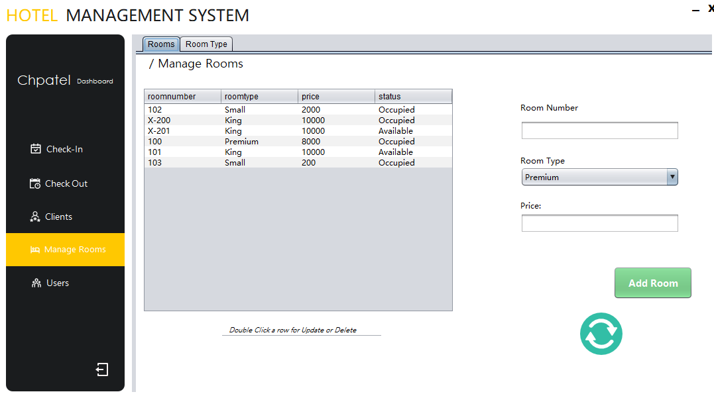
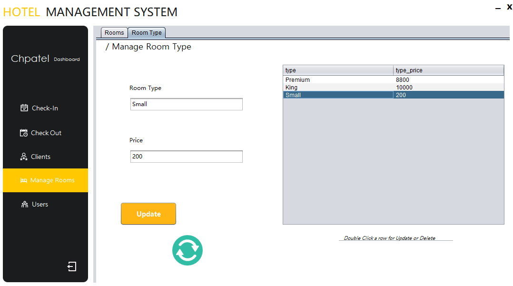

## CHPATEL HOTEL MANAGEMENT SYSTEM

A Chpatel hotel management system is a free system tailored for managing a hotel. This is made particularly for educational purposes. You are free to use and improve this system.

<br />

## Pre-requisite
  **Netbeans must be installed in order for the code to work**   

<br />


## Installation

1. Clone the repository to your desired directory:
   ```bash
   git clone https://github.com/ixynGIT/hotel-management-system.git [YourDirectoryName]
    ```
2. Open netbeans
    
3. Open the project `Ctrl+Shift+O`
   Navigate through the cloned project and access the project folder.
   
5. Download the `plasabas_db.sql` file and import it in your mysql app of choice.

<br />

## Usage

1. Run the project.
  
2. Default credentials | username: `register` | password:`123`

<br />


## Functionalities


1. **Login:**
We created a register and forgot page. The data saved will go directly in the users section which all the admins have the access to edit the saved informations freely.

<br />


<br />
<br />

2. **Check-in and Check-out module:**
  Get necessary Details from the Customer for proper data and archive. Calculate the cost of their stay instantly with automized calculation of customer stay.
  The price and room type are attached to each other.

<br />

**Check In**



<br />

**Check Out**




<br />
<br />

3. **Clients:**
  After you Checked in a guest their information is automatically stored in the client’s tab with all their details with easy access.



<br />
<br />

4. **Manage Rooms:**
  We have created a great and user-friendly UI to mange rooms it has a JTabbedPane which you can configure the rooms customizing the price and room types, etc.





